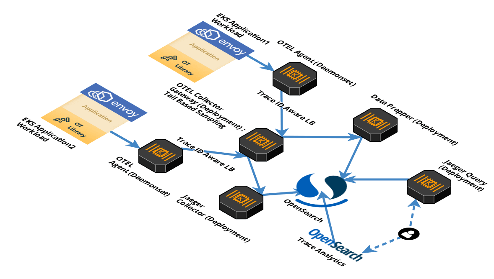
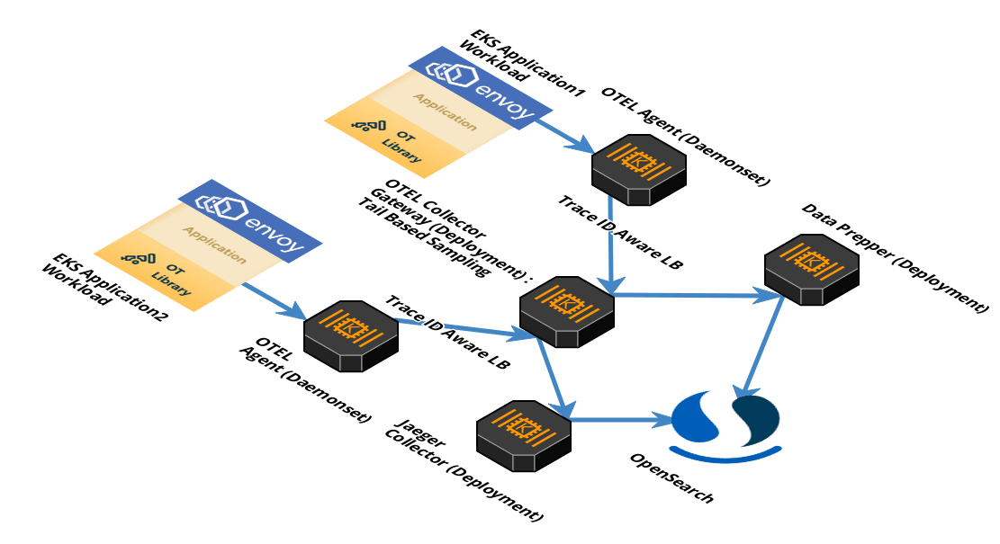

# Building a distributed tracing pipeline with open telemetry collector, data prepper, and OpenSearch trace analytics

Over the past few years, the importance of observability when developing and managing applications has spiked with the spotlight firmly on micro-services, service mesh. Distributed services can be unpredictable. Despite our best efforts, failures and performance bottlenecks in such systems are inevitable and difficult to isolate. In such an environment, having deep visibility into the behavior of your applications is critical for software development teams and operators.

The landscape for observability tools continues to grow as we speak. In particular, when it comes to metrics, error logging, and distributed traces. These can provide valuable information to optimize service performance and troubleshoot issues to make a service more reliable. With this in mind, it makes sense to create a distributed tracing pipeline to ingest, process, and visualize tracing data with query/alerting.

At [Dow Jones](#TODO), we started on a similar journey as we continue to move our applications and microservices to our service mesh based on [EKS](https://docs.aws.amazon.com/whitepapers/latest/overview-deployment-options/amazon-elastic-kubernetes-service.html) and [istio](https://istio.io/). Our requirements formulated from the generated service mesh telemetry data was to have a distributed tracing pipeline that could scale to the amount of our traces, work for applications regardless of host, and the language of implementation. OpenTelemetry's full support for traces, metrics, and logs, as well as, provide a single implementation married perfectly into this idea.

OpenTelemetry (OTEL) is formed by the merging of OpenTracing and OpenCensus. It is a CNCF incubating project and the second most active in terms of contributions. OTEL, since its inception, aimed to offer a single set of APIs and libraries that standardize how you collect and transfer telemetry data.

[Traces was the first component to reach stable status for the open telemetry project](https://opentelemetry.io/status/). Since then, almost all trace components but collector has reached stable maturity level, metrics are well on their way, and initial work on logs has also started. At Dow Jones, we launched a distributed tracing pipeline based on the OpenTelemetry project. I will be going over a few of the design decisions we implemented in our setup and source code to DIY.

## Tracing Pipeline Components

With OpenTelemetry as the core of our pipeline, we still needed to decide on the sink for our traces, tools to visualize and query traces, and tools to export traces in order to create a Federated architecture. After much deliberation, we decided on the following components:

- **OpenTelemetry** for creation, propagation, collection, processing, and exporting of trace data.

- **AWS OpenSearch** (formerly ElasticSearch) as the sink for the traces

OpenSearch is a community-driven, open source search and analytics suite derived from Apache 2.0 licensed Elasticsearch 7.10.2 & Kibana 7.10.2. Additionally, it comes with managed Trace Analytics plugin, a visualization and user interface, and OpenSearch Dashboards.

- **Data Prepper** and **Jaeger** to re-format OpenTelemetry trace data and export it to OpenSearch in formats that both the OpenSearch dashboard and Jaeger understand. (This should go away soon as both Jaeger and OpenSearch Dashboards will natively be able to use OTLP traces)

[Jaeger](https://www.jaegertracing.io/) tracks and measures requests and transactions by analyzing end-to-end data from service call chains, making it easier to understand latency issues in microservice architectures. It's exclusively meant for distributed tracing with a simple web UI to query traces and spans across services. Jaeger enables views of individual traces in a waterfall-style graph of all the related trace and span executions, service invocations for each trace, time spent in each service and each span, and the payload content of each span, including errors.

Data Prepper is a new component of OpenSearch that receives trace data from the OpenTelemetry collector, aggregates, transforms, and normalizes it for analysis and visualization in Kibana.

- **Trace Analytics Plugin** for opensearch to visualize and query traces

The Trace Analytics plugin also aggregates trace data into Trace Group views and Service Map views, to enable monitoring insights of application performance on trace data. By going beyond the ability to search and analyze individual traces, these features enable developers to proactively identify application performance issues, not just react to problems when they occur.

## Architecture

Once we got the components for the pipeline penciled, the remaining work to get them to play nice with each other and scale to our requirement. Since then, the tracing pipeline has been launched in production and processes 4-6 TB of traces daily. In a nutshell, the flow is as follows:

**→** Applications use OpenTelemetry libraries/API to instrument traces and send it to open telemetry agents.

**→** OpenTelemetry agents process/batches and send traces from microservices to the openTelemetry gateway collector.

**→** The collector processes/samples the traces and export them to backends which in our case are data prepper and jaeger collector. These backends transform and export the data to opensearch.

**→** Trace Analytics plugin for Kibana and Jaeger visualizes trace data from opensearch and allows querying on it.



Let's break it down further by the flow of traces through the distributed tracing pipeline ...

## Breakdown

### Step 1 : Creating and Propagating traces

#### Creating traces

We need to create/propagate traces to be able to use a distributed tracing pipeline. OpenTelemetry provides a collection of tools such as API, SDK and integrates with popular languages and frameworks to integrate with the greater OpenTelemetry ecosystem, such as OpenTelemetry Protocol (OTLP) and the OpenTelemetry collector.

OpenTelemetry provides a [status page](https://opentelemetry.io/status/) to keep track of its multiple tools as they go stable. Additionally, it provides documentation on how to create distributed traces for your service both [manually or with auto instrumentation](https://opentelemetry.io/docs/concepts/instrumenting/)

The documentation should get you started with creating standard OTEL traces for your service.

#### Propagating traces

Once we have traces created for services, context propagation is required to convert these traces to distributed traces. Context propagation facilitates the movement of context between services and processes. Context is injected into a request and extracted by a receiving service to parent new spans. That service may then make additional requests and inject context to be sent to other services...and so on.

There are several protocols for context propagation that OpenTelemetry recognizes.

- [W3C Trace-Context HTTP Propagator](https://w3c.github.io/trace-context/)
- [W3C Correlation-Context HTTP Propagator](https://w3c.github.io/correlation-context/)
- [B3 Zipkin HTTP Propagator](https://github.com/openzipkin/b3-propagation)

This works well for our service mesh PaaS as Istio leverages Envoy’s distributed tracing feature to provide tracing integration out of the box. Specifically, Istio provides options to install various tracing backend and configure proxies to send trace spans to them automatically. It requires an application to propagate the [B3 Zipkin HTTP Propagator](https://github.com/openzipkin/b3-propagation) headers, so that when the proxies send span information, the spans can be correlated correctly into a single trace. This natively works with OpenTelemetry as well, since this is a supported context OpenTelemetry context propagation.

### Data Collection

Once we have the tracing data created and propagated through services, the OpenTelemetry project facilitates the collection of telemetry data via the [Open Telemetry collector](https://opentelemetry.io/docs/collector/). The OpenTelemetry collector offers a vendor-agnostic implementation on how to receive, process, and export telemetry data. It removes the need to run, operate, and maintain multiple agents/collectors in order to support open-source observability data formats exporting to one or more backends. In addition, the collector gives end-users control of their data. The collector is the default location where instrumentation libraries export their telemetry data to.

OpenTelemetry binary can be deployed in two primary deployment methods. For production workloads, it is recommended to go with a mix of both methods.

The two primary deployment methods:

- **Agent**: A collector instance running with the application or on the same host as the application (e.g. binary, sidecar, or daemonset).
- **Gateway**: One or more collector instances running as a standalone service (e.g. container or deployment) typically per cluster, data center or region.

We will be deploying a mix of both the agent and the gateway in our setup.

### Step 2 : OpenTelemetry Agents

We will be deploying OpenTelemetry agents as daemonset to receive, process, and export trace from every EKS worker node. Agent is capable of receiving telemetry data (push and pull based) as well as enhancing telemetry data with metadata such as custom tags or infrastructure information. In addition, the agent can offload responsibilities that client instrumentation would otherwise need to handle including batching, retry, encryption, compression, and more.

The agent can be deployed either as a daemonset or as a sidecar in a Kubernetes cluster. This step may be skipped (not recommended), if you are creating this pipeline in a test environment and would rather send traces straight to the open telemetry collector, which is running as a deployment (horizontally scalable)


<details>
  <summary><em><b>Click to expand : K8s Manifest for OpenTelemetry Agent</b></em></summary>

```yaml
---
apiVersion: v1
kind: ConfigMap
metadata:
  name: otel-agent-conf
  namespace: tracing
  labels:
    app: opentelemetry
    component: otel-agent-conf
data:
  otel-agent-config: |
    receivers:
      otlp:
        protocols:
          grpc:
          http:
    exporters:
      otlp:
        endpoint: "otel-collector.tracing:4317"
        tls:
          insecure: true
        sending_queue:
          num_consumers: 20
          queue_size: 10000
        retry_on_failure:
          enabled: true
      loadbalancing:
        protocol:
          otlp:
            # all options from the OTLP exporter are supported
            # except the endpoint
            tls:
              insecure: true
            sending_queue:
              num_consumers: 20
              queue_size: 10000
            retry_on_failure:
              enabled: true
        resolver:
          dns:
            hostname: otel-collector.tracing
            port: 4317
    processors:
      resource:
        attributes:
        - key: k8s.cluster.region
          value: "region-name"
          action: insert
        - key: k8s.cluster.name
          value: "cluster-name"
          action: insert
        - key: k8s.cluster.env
          value: "environment-name"
          action: insert
      # The resource detector injects the pod IP
      # to every metric so that the k8sattributes can
      # fetch information afterwards.
      resourcedetection:
        detectors: ["eks"]
        timeout: 5s
        override: true
      memory_limiter:
        check_interval: 1s
        limit_percentage: 50
        spike_limit_percentage: 30
    extensions:
      memory_ballast:
        size_in_percentage: 20
    service:
      pipelines:
        traces/1:
          receivers: [otlp]
          processors: [memory_limiter, batch, resourcedetection, resource]
          exporters: [loadbalancing]
---
apiVersion: apps/v1
kind: DaemonSet
metadata:
  name: otel-agent
  namespace: tracing
  labels:
    app: opentelemetry
    component: otel-agent
spec:
  selector:
    matchLabels:
      app: opentelemetry
      component: otel-agent
  template:
    metadata:
      annotations:
        prometheus.io/scrape: "true"
        prometheus.io/port: "8888"
        prometheus.io/path: "/metrics"
      labels:
        app: opentelemetry
        component: otel-agent
    spec:
      containers:
        - command:
            - "/otelcontribcol"
            - "--config=/conf/otel-agent-config.yaml"
          image: otel/opentelemetry-collector-contrib:0.37.1
          name: otel-agent
          env:
            - name: POD_IP
              valueFrom:
                fieldRef:
                  fieldPath: status.podIP
            # This is picked up by the resource detector
            - name: OTEL_RESOURCE
              value: "k8s.pod.ip=$(POD_IP)"
          resources:
            limits:
              cpu: 500m #TODO - adjust this to your own requirements
              memory: 500Mi #TODO - adjust this to your own requirements
            requests:
              cpu: 100m #TODO - adjust this to your own requirements
              memory: 100Mi #TODO - adjust this to your own requirements
          ports:
            - containerPort: 55680 # Default OpenTelemetry receiver port.
              hostPort: 55680
            - containerPort: 4317 # New OpenTelemetry receiver port.
              hostPort: 4317
          volumeMounts:
            - name: otel-agent-config-vol
              mountPath: /conf
          livenessProbe:
            httpGet:
              path: /
              port: 13133 # Health Check extension default port.
          readinessProbe:
            httpGet:
              path: /
              port: 13133 # Health Check extension default port.
      volumes:
        - configMap:
            name: otel-agent-conf
            items:
              - key: otel-agent-config
                path: otel-agent-config.yaml
          name: otel-agent-config-vol
---
```

</details>

### Step 3 : OpenTelemetry Gateway

The OpenTelemetry agent forwards the telemetry data to an OpenTelemetry collector gateway. A Gateway cluster runs as a standalone service and offers advanced capabilities over the agent, including tail-based sampling. In addition, a Gateway cluster can limit the number of egress points required to send data, as well as consolidate API token management. Each collector instance in a Gateway cluster operates independently, so it can be scaled with a simple load balancer. We will deploy gateway as a kubernetes [deployment type](https://kubernetes.io/docs/concepts/workloads/controllers/deployment/).

K8s deployments are highly elastic and can be automatically scaled up and down via Horizontal Pod Autoscale depending on the amount of traces flowing through the pipeline.


The agent-gateway architecture also allows us to use [Tail Sampling Processor](https://github.com/open-telemetry/opentelemetry-collector-contrib/blob/main/processor/tailsamplingprocessor/README.md) with more availability in this setup. Tail Sampling Processor enables us to make more intelligent choices when it comes to sampling traces. This is especially true for latency measurements, which can only be measured after they are complete. Since the collector sits at the end of the pipeline and has a complete picture of the distributed trace, sampling determinations are made in opentelemetry collector to sample based on isolated, independent portions of the trace data.

Today, this processor only works with a single instance of the collector. The workaround is to utilize [Trace ID aware load balancing](https://github.com/open-telemetry/opentelemetry-collector-contrib/blob/main/exporter/loadbalancingexporter/README.md) to support multiple collector instances and avoid a single point of failure. This load balancer exporter is added to the agent configuration. It is responsible for consistently exporting spans and logs belonging to a trace to the same backend gateway collector for tail based sampling.

### Filtering traces for tail based sampling

We will use a combination of filters to sample the traces. The filters for tail sampling are positive selections only, so if a trace is caught by any of the filter, it will be sampled; Alternatively, if no filter catches a trace, then it will not be sampled. The filters for tail based sampling can be chained together to get the desired effect:

- **latency**: Sample based on the duration of the trace. The duration is determined by looking at the earliest start time and latest end time, without taking into consideration what happened in between.
- **probabilistic**: Sample a percentage of traces.
- **status_code**: Sample based upon the status code (OK, ERROR or UNSET)
- **rate_limiting**: Sample based on rate of spans per trace per second
- **string_attribute**: Sample based on string attributes value matches, both exact and regex value matches are supported

Since there is no blocklist for filters, we will be using a workaround to sample all but cherrypick services that we do not want sampled. we will be using the `string_attribute` filter to create a negative filter. The filter will be dropping specific service traces that we do not want sampled and sample all other traces. This can be done using the following:

- **&#8594;** In the agent config, add a span attribute for all traces with a key/value pair (e.g - retain_span/false) using attribute processor.
- **&#8594;** In the agent config, add another attribute processor now to override that value to false for cherrypicked services that we don't want to be sampled.
- **&#8594;** In the gateway config, use the string attribute filter on tail based sampling with the **key: retain_span** and **value: true**. All traces without *retain_span: true* attribute will not be sampled.

<details>
  <summary><em><b>Click to expand : K8s Manifest for OpenTelemetry collector </b></em></summary>

```yaml
---
apiVersion: v1
kind: ConfigMap
metadata:
  name: otel-collector-conf
  namespace: tracing
  labels:
    app: opentelemetry
    component: otel-collector-conf
data:
  otel-collector-config: |
    receivers:
      otlp:
        protocols:
          grpc:
          http:
    processors:
      # This processor inspects spans looking for matching attributes.
      # Spans that DONT MATCH this will have a new attribute added named retain-span
      # This is then used by the tail_sampling processor to only export spans that
      # have the retain-span attribute.
      # All conditions have to match here to be excluded.
      attributes/filter_spans1:
        exclude:
          match_type: strict
          attributes:
            - {key: "foo", value: "bar"}
        actions:
          - key: retain-span
            action: insert
            value: "true"
      attributes/filter_spans2:
        include:
          match_type: regexp
          regexp:
            # cacheenabled determines whether match results are LRU cached to make subsequent matches faster.
            # Cache size is unlimited unless cachemaxnumentries is also specified.
            cacheenabled: true
          span_names: ["serviceA*"]
        actions:
          - key: retain-span
            action: update
            value: "false"
      # Any policy match will make the trace be sampled !, enable regex didnt caused nothing to match
      tail_sampling:
        decision_wait: 10s
        expected_new_traces_per_sec: 300
        policies:
          [   
            {
              name: policy-retain-span,
              type: string_attribute,
              string_attribute: {key: retain-span, values: ['true']}
            },
            {
            name: rate-limiting-policy,
            type: rate_limiting,
            rate_limiting: {spans_per_second: 35}
            },
            {
            name: probabilistic-sampling,
            type: probabilistic,
            probabilistic: {sampling_percentage: 50}
            }
          ]
      # The k8sattributes in the Agent is in passthrough mode
      # so that it only tags with the minimal info for the
      # collector k8sattributes to complete
      k8sattributes:
        passthrough: true
      memory_limiter:
        check_interval: 1s
        limit_percentage: 50
        spike_limit_percentage: 30
    extensions:
      memory_ballast:
        size_in_percentage: 20
    exporters:
      logging:
        loglevel: info
      otlp/data-prepper:
        endpoint: data-prepper-headless:21890
        tls:
          insecure: true
      jaeger:
        endpoint: "http://jaeger-collector.tracing.svc.cluster.local:14250"
        tls:
          insecure: true
    service:
      pipelines:
        traces/1:
          receivers: [otlp]
          processors: [memory_limiter, k8sattributes, attributes/filter_spans1, attributes/filter_spans2, tail_sampling]
          exporters: [jaeger, otlp/data-prepper]
---
apiVersion: v1
kind: Service
metadata:
  name: otel-collector
  namespace: tracing
  labels:
    app: opentelemetry
    component: otel-collector
spec:
  ports:
    - name: otlp # Default endpoint for OpenTelemetry receiver.
      port: 55680
      protocol: TCP
      targetPort: 55680
    - name: grpc-otlp # New endpoint for OpenTelemetry receiver.
      port: 4317
      protocol: TCP
      targetPort: 4317
    - name: metrics # Default endpoint for querying metrics.
      port: 8888
  selector:
    component: otel-collector
---
apiVersion: apps/v1
kind: Deployment
metadata:
  name: otel-collector
  namespace: tracing
  labels:
    app: opentelemetry
    component: otel-collector
spec:
  selector:
    matchLabels:
      app: opentelemetry
      component: otel-collector
  minReadySeconds: 5
  progressDeadlineSeconds: 120
  replicas: 4 #TODO - adjust this to your own requirements
  template:
    metadata:
      annotations:
        prometheus.io/scrape: "true"
        prometheus.io/port: "8888"
        prometheus.io/path: "/metrics"
      labels:
        app: opentelemetry
        component: otel-collector
    spec:
      containers:
        - command:
            - "/otelcontribcol"
            - "--log-level=debug"
            - "--config=/conf/otel-collector-config.yaml"
          image: otel/opentelemetry-collector-contrib:0.37.1
          name: otel-collector
          resources:
            limits:
              cpu: 2 #TODO - adjust this to your own requirements
              memory: 4Gi #TODO - adjust this to your own requirements
            requests:
              cpu: 1 #TODO - adjust this to your own requirements
              memory: 2Gi #TODO - adjust this to your own requirements
          ports:
            - containerPort: 55680 # Default endpoint for OpenTelemetry receiver.
            - containerPort: 4317 # Default endpoint for OpenTelemetry receiver.
            - containerPort: 8888 # Default endpoint for querying metrics.
          volumeMounts:
            - name: otel-collector-config-vol
              mountPath: /conf
          livenessProbe:
            httpGet:
              path: /
              port: 13133 # Health Check extension default port.
          readinessProbe:
            httpGet:
              path: /
              port: 13133 # Health Check extension default port.
      volumes:
        - configMap:
            name: otel-collector-conf
            items:
              - key: otel-collector-config
                path: otel-collector-config.yaml
          name: otel-collector-config-vol
---
```

</details>

### Formatting and Exporting Traces

We now have distributed traces created, context propagated, and sampled using tail based sampling. We need to format the trace data in a way that our query engine can analyze it. At Dow Jones we have teams that rely on Jaeger and Kibana Trace Analytics to query and visualize this data. With OpenTelemetry, we can push the data to multiple backends from the same collector. At present, there is one caveat, both [Trace Analytics OpenSearch Dashboards plugin](https://opensearch.org/docs/monitoring-plugins/trace/ta-dashboards/) and [Jaeger](https://www.jaegertracing.io/) need OpenTelemetry data transformed to be able to visualize it mandating the need for last mile server-side components:

- **Jaeger collector**

[Jaeger is actively working toward the future Jaeger backend components to be based on OpenTelemetry collector](https://www.jaegertracing.io/docs/1.21/opentelemetry/). This integration will make all OpenTelemetry collector features available in the Jaeger backend components. Till this is experimental, Jaeger collector is required to transform the traces before shipping to OpenSearch so that Jaeger UI (query component) is able to consume and visualize the trace data. Jaeger collector is deployed as a deployment with a horizontal pod autoscaler.

<details>
  <summary><em><b>Click to expand : Helm Chart for Jaeger collector</b></em></summary>

```yaml
# All operations of service foo are sampled with probability 0.8 except for operations op1 and op2 which are probabilistically sampled with probabilities 0.2 and 0.4 respectively.
# All operations for service bar are rate-limited at 5 traces per second.
# Any other service will be sampled with probability 1 defined by the default_strategy.

provisionDataStore:
  cassandra: false
storage:
  type: elasticsearch
  elasticsearch:
    scheme: https
    usePassword: false
    host: "opensearch-arn.us-east-1.es.amazonaws.com"
    port: "443"

tag: 1.22.0

agent:
  enabled: false

collector:
  autoscaling:
    enabled: true
    targetMemoryUtilizationPercentage: 80
  service:
  serviceAccount:
    name: jaeger
  samplingConfig: |-
    {
      "service_strategies": [
        {
          "service": "foo",
          "type": "probabilistic",
          "param": 0.8
        },
        {
          "service": "bar",
          "type": "ratelimiting",
          "param": 5
        }
      ],
      "default_strategy": {
        "type": "probabilistic",
        "param": 1.0
      }
    }

query:
  enabled: false
```

</details>

- **Data Prepper**

Similar to Jaeger, to vizualize distributed traces through Trace Analytics in OpenSearch, we need to transform these traces for OpenSearch. Data Prepper is a key component in providing Trace Analytics feature in OpenSearch. Data Prepper is a last mile server-side component collecting telemetry data from AWS Distro OpenTelemetry collector or OpenTelemetry collector and transforms it for OpenSearch. Data Prepper is a data ingestion component of the OpenSearch project that pre-processes documents before storing and indexing in OpenSearch. To pre-process documents, Data Prepper allows you to configure a pipeline that specifies a source, buffers, a series of processors, and sinks. Once you have configured a data pipeline, Data Prepper takes care of managing source, sink, buffer properties, and maintains state across all instances of Data Prepper on which the pipelines are configured. A single instance of Data Prepper can have one or more pipelines configured. A pipeline definition requires at least a source and sink attribute to be configured, and will use the default buffer and no processor if they are not configured. Data Prepper can be deployed as a deployment with a horizontal pod autoscaler.

<details>
  <summary><em><b>Click to expand : K8s Manifest for Data Prepper</b></em></summary>

```yaml
apiVersion: v1
kind: ConfigMap
metadata:
  namespace: tracing
  labels:
    app: data-prepper
  name: data-prepper-config
data:
  pipelines.yaml: |
    entry-pipeline:
      workers : 8
      delay: "100"
      buffer:
        bounded_blocking:
          # buffer_size is the number of ExportTraceRequest from otel-collector the data prepper should hold in memeory.
          # We recommend to keep the same buffer_size for all pipelines.
          # Make sure you configure sufficient heap
          # default value is 512
          buffer_size: 4096
          # This is the maximum number of request each worker thread will process within the delay.
          # Default is 8.
          # Make sure buffer_size >= workers * batch_size
          batch_size: 512
      source:
        otel_trace_source:
          health_check_service: true
          ssl: false
      prepper:
        - peer_forwarder:
            discovery_mode: "dns"
            domain_name: "data-prepper-headless"
            ssl: false
      sink:
        - pipeline:
            name: "raw-pipeline"
        - pipeline:
            name: "service-map-pipeline"
    raw-pipeline:
      workers : 8
      buffer:
        bounded_blocking:
          # Configure the same value as in otel-trace-pipeline
          # Make sure you configure sufficient heap
          # default value is 512
          buffer_size: 4096
          # The raw prepper does bulk request to your elasticsearch sink, so configure the batch_size higher.
          # If you use the recommended otel-collector setup each ExportTraceRequest could contain max 50 spans. https://github.com/opendistro-for-elasticsearch/data-prepper/tree/v0.7.x/deployment/aws
          # With 64 as batch size each worker thread could process upto 3200 spans (64 * 50)
          batch_size: 512
      source:
        pipeline:
          name: "entry-pipeline"
      prepper:
        - otel_trace_raw_prepper:
      sink:
        - opensearch:
            hosts:
              - "https://opensearch-arn.us-east-1.es.amazonaws.com"
            insecure: false
            aws_sigv4: true
            aws_region: "region-name"
            trace_analytics_raw: true
    service-map-pipeline:
      workers : 1
      delay: "100"
      source:
        pipeline:
          name: "entry-pipeline"
      prepper:
        - service_map_stateful:
      buffer:
        bounded_blocking:
          # buffer_size is the number of ExportTraceRequest from otel-collector the data prepper should hold in memory.
          # We recommend to keep the same buffer_size for all pipelines.
          # Make sure you configure sufficient heap
          # default value is 512
          buffer_size: 512
          # This is the maximum number of request each worker thread will process within the delay.
          # Default is 8.
          # Make sure buffer_size >= workers * batch_size
          batch_size: 8
      sink:
        - opensearch:
            hosts:
              - "https://opensearch-arn.us-east-1.es.amazonaws.com"
            insecure: false
            aws_sigv4: true
            aws_region: "region-name"
            trace_analytics_service_map: true
  data-prepper-config.yaml: |
    ssl: false
---
apiVersion: v1
kind: Service
metadata:
  namespace: tracing
  labels:
    app: data-prepper
  name: data-prepper-headless
spec:
  clusterIP: None
  ports:
    - name: "21890"
      port: 21890
      targetPort: 21890
  selector:
    app: data-prepper
---
apiVersion: v1
kind: Service
metadata:
  namespace: tracing
  labels:
    app: data-prepper
  name: data-prepper-metrics
spec:
  type: NodePort
  ports:
    - name: "4900"
      port: 4900
      targetPort: 4900
  selector:
    app: data-prepper
---
apiVersion: apps/v1
kind: Deployment
metadata:
  namespace: tracing
  labels:
    app: data-prepper
  name: data-prepper
spec:
  replicas: 4
  selector:
    matchLabels:
      app: data-prepper
  strategy:
    type: Recreate
  template:
    metadata:
      annotations:
        prometheus.io/scrape: "true"
        prometheus.io/port: "4900"
        prometheus.io/path: "/metrics"
        sidecar.istio.io/inject: "false"
      labels:
        app: data-prepper
    spec:
      containers:
        - args:
            - java
            - -jar
            - /usr/share/data-prepper/data-prepper.jar
            - /etc/data-prepper/pipelines.yaml
            - /etc/data-prepper/data-prepper-config.yaml
            - -Dlog4j.configurationFile=config/log4j2.properties
          image: amazon/opendistro-for-elasticsearch-data-prepper:1.1.0
          imagePullPolicy: IfNotPresent
          name: data-prepper
          resources:
            limits:
              cpu: 1
              memory: 2Gi
            requests:
              cpu: 200m
              memory: 400Mi
          ports:
            - containerPort: 21890
          volumeMounts:
            - mountPath: /etc/data-prepper
              name: prepper-configmap-claim0
            - mountPath: config
              name: prepper-log4j2
      restartPolicy: Always
      volumes:
        - name: prepper-configmap-claim0
          configMap:
            name: data-prepper-config
        - name: prepper-log4j2
          configMap:
            name: data-prepper-log4j2
---
apiVersion: v1
kind: ConfigMap
metadata:
  namespace: tracing
  labels:
    app: data-prepper
  name: data-prepper-log4j2
data:
  log4j2.properties: |
    status = error
    dest = err
    name = PropertiesConfig

    property.filename = log/data-prepper/data-prepper.log

    appender.console.type = Console
    appender.console.name = STDOUT
    appender.console.layout.type = PatternLayout
    appender.console.layout.pattern = %d{ISO8601} [%t] %-5p %40C - %m%n

    rootLogger.level = warn
    rootLogger.appenderRef.stdout.ref = STDOUT

    logger.pipeline.name = com.amazon.dataprepper.pipeline
    logger.pipeline.level = info

    logger.parser.name = com.amazon.dataprepper.parser
    logger.parser.level = info

    logger.plugins.name = com.amazon.dataprepper.plugins
    logger.plugins.level = info
---
```

</details>

### Sink : OpenSearch

As you must have noticed in the architecture, we utilize OpenSearch to ship to and store traces. [Opensearch](https://aws.amazon.com/blogs/opensource/introducing-opensearch/) is a community-driven, open source fork of Elasticsearch and Kibana. This project includes OpenSearch (derived from Elasticsearch 7.10.2) and OpenSearch Dashboards (derived from Kibana 7.10.2). Additionally, the OpenSearch project is the new home for the previous distribution of Elasticsearch (Open Distro for Elasticsearch)

OpenSearch makes an excellent choice for storing and searching trace data, along with other observability data due to its fast search capabilities and horizontal scalability.



Jaeger collector and Data Prepper can be configured to ship traces to the same OpenSearch. Both deployments create their indexes with a mutually exclusive prefix for name. OpenSearch can be configured with index patterns to create seperate views:
- Jaeger : `jaeger-span*`
- Trace Analytics : `otel-v1-apm-span*`

Trace analytics and Jaeger UI (Query component) are configured to analyze their indexes based on prefix and do not collide with each other. This allows for a single OpenSearch service with multiple data formats existing side by side.

### Step 4 : Visualization

Once you reach this point, the difficult part is over. You should have distributed traces created, context propagated, and sampled using tail based sampling, transformed, and exported to OpenSearch under different index patterns.

Now is the part where you actually get to use the pipeline and visualize these traces to run queries, build dashboards, setup alerting. While Trace Analytics OpenSearch Dashboards plugin is a managed plugin that comes with OpenSearch, we host our own [Jaeger Frontend/UI](https://www.jaegertracing.io/docs/1.28/frontend-ui/) with a simple jaeger UI to query for distributed traces with Traces View
and Traces Detail View. We deploy Jaeger Query as a deployment within the EKS cluster. Jaeger query can be deployed as a deployment with a horizontal pod autoscaler.


- **Jaeger UI (query)**

To visualize your traces with Jaeger we need to run a Jaeger query. jaeger-query serves the API endpoints and a React/Javascript UI. The service is stateless and is typically run behind a load balancer:

<details>
  <summary><em><b>Click to expand : Helm Chart for Jaeger Query</b></em></summary>

```yaml
# All operations of service foo are sampled with probability 0.8 except for operations op1 and op2 which are probabilistically sampled with probabilities 0.2 and 0.4 respectively.
# All operations for service bar are rate-limited at 5 traces per second.
# Any other service will be sampled with probability 1 defined by the default_strategy.

provisionDataStore:
  cassandra: false
storage:
  type: elasticsearch
  elasticsearch:
    scheme: https
    usePassword: false
    host: "opensearch-arn.us-east-1.es.amazonaws.com"
    port: "443"

tag: 1.22.0

agent:
  enabled: false

collector:
  enabled: false

query:
  enabled: true
  agentSidecar:
    enabled: false
  service:
    type: LoadBalancer
    port: 443
    annotations:
      service.beta.kubernetes.io/aws-load-balancer-ssl-cert: ""
      service.beta.kubernetes.io/aws-load-balancer-internal: 0.0.0.0/0
  config: |-
    {
      "dependencies": {
        "dagMaxNumServices": 200,
        "menuEnabled": true
      },
      "menu": [
    {
      "label": "Open Telemetry Resources",
      "items": [
        {
          "label": "Open Telemetry Client Instrumentation",
          "url": "https://opentelemetry.io/docs/"
        }
          ]
        }
      ],
      "archiveEnabled": true,
      "search": {
        "maxLookback": {
          "label": "7 Days",
          "value": "7d"
        },
        "maxLimit": 1500
      }
    }

spark:
  enabled: false

esIndexCleaner:
  enabled: false

esRollover:
  enabled: false

esLookback:
  enabled: false
```

</details>

- **Trace Analytics feature in OpenSearch/Kibana**

[Amazon Elasticsearch Service released Trace Analytics](https://aws.amazon.com/blogs/big-data/getting-started-with-trace-analytics-in-amazon-elasticsearch-service/), a new feature for distributed tracing that enables developers and operators to troubleshoot performance and availability issues in their distributed applications, giving them end-to-end insights not possible with traditional methods of collecting logs and metrics from each component and service individually. Trace Analytics supports OpenTelemetry, enabling customers to leverage Trace Analytics without having to re-instrument their applications.

Once you have traces flowing through your pipeline, you should see indexes being created in OpenSearch under the otel-v1\* index prefix. As this is created, trace analytics plugin within OpenSearch dashboards should now have visualization for your traces, inclusive of service map, error/throughput graphs, and waterfall trace view for your services.


## Testing

We now have the distributed tracing pipeline. It is time to start an application that generates traces and exports them to agents. Depending on your application code and whether you want to do manual or automatic instrumentation, the [Open Telementry Instrumentation Docs](https://opentelemetry.io/docs/) should get you started.

In this setup, OTEL agents are running as daemonset. We will be exporting traces from the service to the agent on the same host(worker-node). To get the host IP, we can set the HOST_IP environment variable via the [Kubernetes downwards API](https://kubernetes.io/docs/tasks/inject-data-application/downward-api-volume-expose-pod-information/#capabilities-of-the-downward-api). It can be referenced in our instrumentation as the destination address.

Make sure you are injecting the HOST_IP environment variable in your application manifest:

```
env:
  - name: HOST_IP
    valueFrom:
      fieldRef:
          fieldPath: status.hostIP
```

To setup the pipeline, you can apply the kubernetes manifest files and helm chart(for jaeger). Besides being in the body of this blog, the manifests have been added to [djin-opensearch-blog github repo](https://github.com/newscorp-ghfb/djin-opensearch-blog/blob/master/source) for convenient access.

## Next Steps

We built a scalable distributed tracing pipeline based on the OpenTelemetry project running in an EKS cluster. One of the driving forces behind our move to OpenTelemetry is to consolidate to a single binary to ingest, process, and export, not just traces but metrics and logs as well (telemetry data). Telemetry data can be exported to multiple backends by creating [pipelines](https://github.com/open-telemetry/opentelemetry-collector/blob/main/docs/design.md#pipelines) for pushing to observability platform of choice.

Data Prepper 1.2 (December 2021) release is going to provide users the ability to send logs from Fluent Bit to OpenSearch or Amazon OpenSearch Service and use Grok to enhance the logs. Logs can then be correlated to traces coming from the OTEL collectors to further enhance deep diving into your service problems using OpenSearch Dashboards. This should elevate the experience of deep diving into your service with a unified view and give a really powerful feature into the hands of developers and operators.

So the next step would naturally be to extend this pipeline to be more than just a distributed tracing pipeline and morph to a distributed telemetry pipeline!

_Comments, questions, corrections? Just let me know on [twitter](https://twitter.com/kub3rkaul), via email kuber.kaul@dowjones.com, or submit a github issue_

Thanks to [EP team](https://github.com/orgs/newscorp-ghfb/teams/dj-ep/members), [Chris Nelligan](https://github.com/nelliganc).

Architecture images created using [cloudcraft.io](https://www.cloudcraft.co/)
