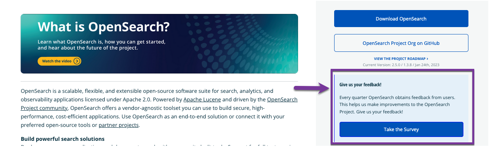

Thank you to the OpenSearch community members who responded to our 2023-Q1 quarterly survey! Our first quarterly survey focused on understanding who our users are, what they use OpenSearch for, and establishing a baseline for how they feel about the current user experience on OpenSearch. We are thrilled to report a NPS (net promotor score) of **57.8** and a UX health score of **77.2** with **97** community members taking part in the survey. 

We’ve recently launched a research program to get a holistic view of of our users’ experience. The program is designed to evaluate a user’s journey comprehensively, and amongst various research methodologies, includes a quarterly survey. In addition to quarterly surveys, the team also utilizes deep-dives, which are qualitative research studies that include conversations with users to understand their use cases, requirements, and OpenSearch experience. The surveys, going live once a quarter, will ask our community members to provide feedback on new features, existing experiences on OpenSearch, and more. This will help the OpenSearch team prioritize improvements to best serve the community. For the deep-dives, we invite community members who are willing to help us understand their use case, to talk to members of the OpenSearch team. After our Q2-2023 survey is live in March, you can access it from the landing page of [OpenSearch.org](http://opensearch.org/):

[Image: survey.png]

Here are some key insights from the Q1 survey:

* We obtained our first NPS and UX health score, and will use these as a baseline to compare against results in future quarters.
* Previously, we were unsure about the split of *search* and *analytics* use cases and were curious if there was an overlap in the way users were utilizing OpenSearch. Around 1/3 (one-third) of the sample that took the survey in Q1 indicated that they used OpenSearch as *both a search and analytics solution*. 
* Users identified with four roles in OpenSearch: 
  - _Infrastructure Set Up_ - responsible for deploying OpenSearch, for allocation of resources, responsible for allocation of initial resources, and any action that impacts the billing and usage or resources
  - _OpenSearch Admin_ - responsible for asset and user management on OpenSearch
  - _Dashboard Creator or Data Producer_ - responsible for preparing data or dashboards for their own use or end user consumption
  - _Dashboard or Data Consumer_ - responsible for consuming data or dashboards
  
* While users do not use the above labels to self-identify, the motivations described in the survey for each of these roles resonated with them.
* 48.8%, or almost half of the community members who took the survey, self-identified themselves to be in an *administrative* role and almost half of the sample associated with all four roles.
* 34.1% self-identified themselves to be in an *infrastructure setup* role. 

Based on these insights, we concluded that close to half of our users have complex needs that span across all four roles, from *infrastructure setup* to *administrative* to *producer* to *consumer*.  Our offerings, therefore, should focus on providing consistent end-to-end workflows and transitions that enable users perform tasks seamlessly. This finding is also a good indication of the sample who accessed the survey on the OpenSearch website. In future quarters we intend to expand recruitment for the quarterly survey to the dashboard interface as well. This will help the OpenSearch team obtain feedback from dashboard users who are typically both *producers* and *consumers*.
 
In Q2 we want to get a deeper understanding of ways to improve user experience on OpenSearch. We want to understand what blockers our users face when setting up OpenSearch for themselves or others. The survey will allow users to provide feedback based on their self-selected roles. We also want to understand what blockers users have when dashboards are set up, shared, and consumed. 

Check out the [OpenSearch website](https://opensearch.org/) or [forum](https://forum.opensearch.org/) in March and take part in our quarterly Q2 community survey. If you are interested in participating in a deep-dive study, you’ll have the opportunity at the end of the survey to provide information on how we can reach you. As always, we welcome all community members to attend our bi-weekly [community meet-ups](https://forum.opensearch.org/t/opensearch-community-meeting-2023-0328/12531) where information on ongoing research studies are regularly announced. 
 
We thank you for reading, and thanks for supporting OpenSearch!

The OpenSearch UX Team
