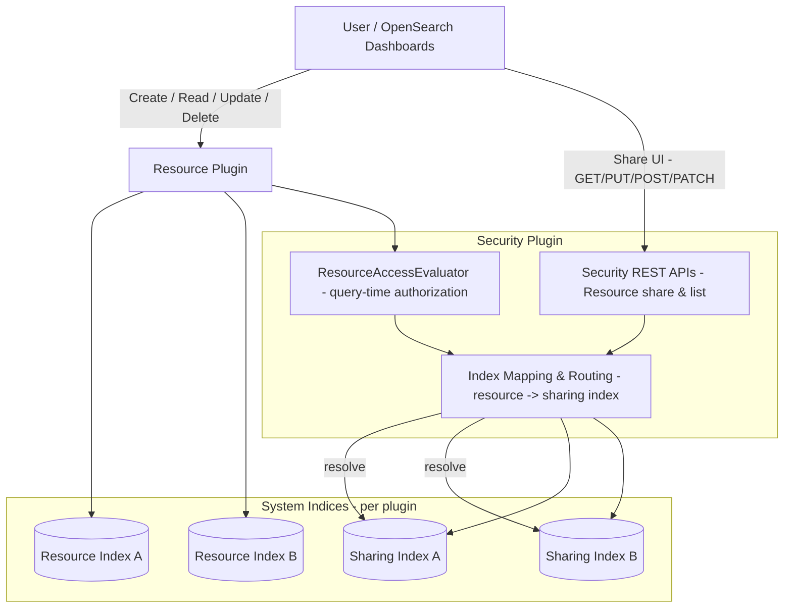
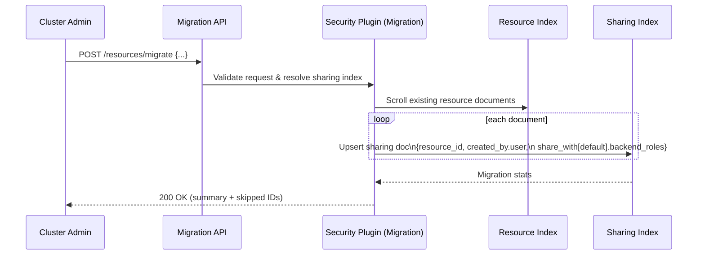

In [Part 1]({{site.baseurl}}/blog/introducing-resource-sharing), we introduced resource sharing and access control as a new way to collaborate on plugin-defined resources such as anomaly detectors and machine learning (ML) models.

This post looks under the hood at how that feature is built and how you can adopt it in your own plugins:

* Why the legacy `filter_by_backend_roles` model was not enough
* How we designed a resource-centric authorization model
* How plugins integrate using the new Security SPI
* How access checks work at query time
* How to migrate safely from legacy behavior
* A practical onboarding path for plugin developers

If you are building or operating plugins on OpenSearch, this is the post you probably care about.

---

## From backend roles to resource owners

Before resource sharing, most OpenSearch plugins used a simple pattern:

* Each resource (detector, model, report, and so on) stored identity metadata (creator, backend roles).
* Visibility was controlled by checking for backend role overlap between creator and viewer.
* In Anomaly Detection, this was controlled by `plugins.anomaly_detection.filter_by_backend_roles`. In ML Commons, by `plugins.ml_commons.model_access_control_enabled`.

This approach worked for basic multi-tenancy but had significant limitations.

### Shortcomings of `filter_by_backend_roles`

1. Implicit, role-coupled sharing

   If two users shared a backend role, they could see each other’s resources. That meant:

    * No way for the owner to say “share with Alice, but not with Bob” if both users shared a role.
    * Removing access required role-mapping changes, not a change on the resource itself.

2. Overly broad cluster privileges

   Because access was controlled at the role level, not the resource level:

    * Roles needed powerful cluster permissions just so users could operate on their own resources.
    * It was difficult to grant “read-only access to this one detector” without granting broader capabilities.

3. Distributed, plugin-specific metadata

   Each plugin implemented its own access logic:

    * Different JSON shapes for “owner” and “shared with”
    * Different user experience patterns in OpenSearch Dashboards
    * No central place to audit “who can see what”

The new framework is designed to fix all of this.

---

## Design goals

When we started designing resource sharing, we focused on a few core principles.

1. Resource-centric security

   Authorization should be driven by who owns this resource and who it is shared with, not by backend-role overlaps that happen to exist.

2. Centralized, reusable logic

    * One framework inside the Security plugin
    * Plugins declare what is shareable and which actions exist
    * Security handles how access is evaluated

3. Minimal changes to plugin APIs

   Plugins should:

    * Keep exposing their existing REST APIs (such as `/detectors`, `/models`, `/reports`)
    * Delegate authorization to the Security framework
    * Avoid copying and pasting “get current user” boilerplate

4. Safe migration

   Existing clusters cannot lose access patterns overnight. We needed:

    * A way to import legacy sharing data into the new framework
    * Feature flags and per-type rollout
    * A reversible, observable migration step

---

## High-level architecture

At a high level, resource sharing splits responsibility across three parts:

* Resource plugins: own the functional resource (detectors, models, reports, dashboards)
* Security plugin: owns the sharing model and access evaluation
* System indices: store resources and the corresponding sharing metadata



Key ideas:

* Each resource index (for example, `.opendistro-anomaly-detectors`) is paired with a sharing index owned by Security.
* Plugins consult the Resource Sharing SPI instead of doing their own access checks.
* OpenSearch Dashboards uses Security REST endpoints to share, list, and manage resources.

The feature is introduced in the Security plugin as an experimental capability, behind the flag:

```yaml
plugins.security.experimental.resource_sharing.enabled: true
```

---

## The resource-sharing data model

Resource sharing introduces a dedicated sharing document per resource, stored in a Security-managed index.

### Sharing document

For each resource, Security stores a document like:

```json
{
  "resource_id": "model-group-123",
  "created_by": {
    "user": "darshit",
    "tenant": "analytics-tenant"
  },
  "share_with": {
    "sample_read_only": {
      "users": ["user1", "user2"],
      "roles": ["viewer_role"],
      "backend_roles": ["data_analyst"]
    },
    "sample_read_write": {
      "users": ["admin_user"],
      "roles": ["editor_role"],
      "backend_roles": ["content_manager"]
    }
  }
}
```

* `resource_id` – Unique ID within the plugin’s resource index.
* `created_by` – Logical owner (user and, optionally, tenant).
* `share_with` – Map of access levels (action groups) to recipients.

Each access level under `share_with` defines three scopes:

* `users` – usernames with this access level
* `roles` – OpenSearch roles with this access level
* `backend_roles` – backend roles with this access level

### Access levels as action groups

In the plugin, access levels are defined as resource action groups in `resource-action-groups.yml`:

```yaml
resource_types:
  sample-resource:
    sample_read_only:
      allowed_actions:
        - "cluster:admin/sample-resource-plugin/get"

    sample_read_write:
      allowed_actions:
        - "cluster:admin/sample-resource-plugin/*"

    sample_full_access:
      allowed_actions:
        - "cluster:admin/sample-resource-plugin/*"
        - "cluster:admin/security/resource/share"
```

Security reads this file at startup and uses it to answer questions like, “Does this user have `sample_read_write` on resource X?”

### Public vs private vs restricted

The `share_with` structure lets you express common patterns.

* Private (default)

```json
{
  "share_with": {}
}
```

Visible only to the owner and super-admins.

* Public

```json
{
  "share_with": {
    "default": {
      "users": ["*"]
    }
  }
}
```

Any authenticated user can access the resource at the `default` access level.

* Restricted

```json
{
  "share_with": {
    "default": {
      "users": ["alice"],
      "roles": ["analytics_viewer"],
      "backend_roles": ["fraud-team"]
    }
  }
}
```

Only the listed principals can access this resource via that access level.

---

## Query-time evaluation: how results are filtered

There are two complementary pieces to runtime evaluation:

1. Implicit filtering for list/search APIs
2. Explicit checks for point operations or custom flows

### 1. Implicit filtering through `all_shared_principals`

When a plugin lists resources, we want it to not care about who the current user is. Instead:

1. The plugin exposes a list or search API (for example, `GET /_plugins/_reports/definitions`).
2. Inside the handler, the plugin issues a search against its system index using a plugin client (a system-level subject).
3. The Security plugin attaches a Document-level security (DLS) query behind the scenes.
4. The DLS query checks an `all_shared_principals` field on each resource document.

A resource document might look like:

```json
{
  "name": "sharedDashboard",
  "description": "Shared with multiple principals",
  "type": "dashboard",
  "created_at": "2025-09-02T14:30:00Z",
  "all_shared_principals": [
    "user:resource_sharing_test_user_alice",
    "user:resource_sharing_test_user_bob",
    "role:analytics_team",
    "role:all_access",
    "role:auditor"
  ]
}
```

If the authenticated user is:

* `username: resource_sharing_test_user_alice`
* with role `analytics_team`

then Security limits the result set to documents where `all_shared_principals` contains:

* `user:resource_sharing_test_user_alice`
* or `role:analytics_team`
* or a wildcard such as `user:*` for public visibility

To make this work in a future-proof way:

* Plugins declare themselves as `IdentityAwarePlugin` so they can use their plugin subject to access system indices.
* The plugin uses its plugin client instead of stashing thread context manually.
* The Security plugin injects the DLS filter automatically.

Here is a snippet from anomaly-detection plugin for usage of PluginClient to perform search:

```java
public void search(SearchRequest request, String resourceType, ActionListener<SearchResponse> actionListener) {
    User user = ParseUtils.getUserContext(client);
    boolean shouldUseResourceAuthz = ParseUtils.shouldUseResourceAuthz(resourceType);
    ActionListener<SearchResponse> listener = wrapRestActionListener(actionListener, CommonMessages.FAIL_TO_SEARCH);
    try (ThreadContext.StoredContext context = client.threadPool().getThreadContext().stashContext()) {
        if (pluginClient != null && shouldUseResourceAuthz) {
            // request will be auto-filtered in security plugin
            pluginClient.search(request, actionListener);
        } else {
            validateRole(request, user, listener);
        }
    } catch (Exception e) {
        logger.error(e);
        listener.onFailure(e);
    }
}
```

### 2. Explicit checks using `ResourceSharingClient`

For operations that cannot rely solely on DLS (for example, get-by-id, update, delete, or non-index-backed resources), plugins call the `ResourceSharingClient` from the SPI.

The SPI provides three main methods:

```java
void verifyAccess(String resourceId,
                  String resourceIndex,
                  String action,
                  ActionListener<Boolean> listener);

void getAccessibleResourceIds(String resourceIndex,
                              ActionListener<Set<String>> listener);

boolean isFeatureEnabledForType(String resourceType);
```

#### `isFeatureEnabledForType`: guard rails

Use this as your top-level guard:

```java
public static boolean shouldUseResourceAuthz(String resourceType) {
    var client = ResourceSharingClientAccessor.getInstance().getResourceSharingClient();
    return client != null && client.isFeatureEnabledForType(resourceType);
}
```

If this returns `false`, you can safely fall back to your legacy behavior (for example, `filter_by_backend_roles`).

#### `verifyAccess`: point checks

Use `verifyAccess` when you want to enforce access on one specific resource and a specific action.

Typical examples:

* `GET /_plugins/_my_plugin/resources/{id}`
* `DELETE /_plugins/_my_plugin/resources/{id}`
* Custom operations such as `/_plugins/_my_plugin/resources/{id}/_search`

Pseudocode:

```java
public void getResourceById(String id, RestChannel channel) {
    if (!shouldUseResourceAuthz("sample-resource")) {
        // Legacy path
        getResourceLegacy(id, channel);
        return;
    }

    var client = ResourceSharingClientAccessor.getInstance().getResourceSharingClient();
    // if this is a protected resource request verifyAccess is not required as the resource access will be evaluated directly
    // call verify access only if resource is protected via hierarchy
    client.verifyAccess(
        id,
        ".sample_resource",
        "cluster:admin/sample-resource-plugin/get",
        ActionListener.wrap(
            allowed -> {
                if (Boolean.FALSE.equals(allowed)) {
                    channel.sendResponse(forbidden(id));
                    return;
                }
                // Now safe to read from the index
                fetchAndReturnResource(id, channel);
            },
            e -> channel.sendResponse(toErrorResponse(e))
        )
    );
}
```

If the Security plugin is disabled, the SPI implementation safely becomes a no-op and treats the request as allowed, so your plugin does not have to special-case that.

#### `getAccessibleResourceIds`: cross-index flows

When you need to filter by ID but cannot rely on DLS, you can retrieve the set of resource IDs that the current user can access and apply your own filters.

For example:

```java
public void getResources(RestChannel channel) {
    client.getAccessibleResourceIds(".sample_resource", ActionListener.wrap(
        accessibleIds -> {
            // Add a terms filter on the resource ID
            SearchSourceBuilder source = new SearchSourceBuilder()
                .query(QueryBuilders.termsQuery("_id", accessibleIds));
            // ...
        },
        e -> channel.sendResponse(toErrorResponse(e))
    ));
}
```

This is a good fit for cases where:

* You need a custom query that does not go through the standard DLS filter path, or
* You are composing results across multiple indices and want to intersect with accessible IDs.

---

## Developer integration: becoming a “resource plugin”

To opt in, a plugin implements the Resource Sharing SPI and follows a few conventions.

### 1. Add SPI dependency and extend the Security plugin

In `build.gradle`:

```gradle
configurations {
  opensearchPlugin
}

dependencies {
  compileOnly group: 'org.opensearch', name: 'opensearch-security-spi', version: "${opensearch_build}"
  opensearchPlugin "org.opensearch.plugin:opensearch-security:${opensearch_build}@zip"
}

opensearchplugin {
    name '<your-plugin>'
    description '<description>'
    classname '<your-classpath>'
    extendedPlugins = ['opensearch-security;optional=true']
}
```

### 2. Implement `ResourceSharingExtension` and register it

Create a class that implements `org.opensearch.security.spi.resources.ResourceSharingExtension`. This class tells Security:

* Which resource indices you own
* Which resource types are shareable
* How those types map to your action groups

Then register it using Java’s SPI mechanism:

```text
src/main/resources/META-INF/services/org.opensearch.security.spi.ResourceSharingExtension
```

The file must contain exactly one line with the fully qualified class name, for example:

```text
org.opensearch.sample.SampleResourceSharingExtension
```

### 3. Provide `resource-action-groups.yml`

Define your resource types and action groups:

```yaml
resource_types:
  sample-resource:
    sample_read_only:
      allowed_actions:
        - "cluster:admin/sample-resource-plugin/get"

    sample_read_write:
      allowed_actions:
        - "cluster:admin/sample-resource-plugin/*"

    sample_full_access:
      allowed_actions:
        - "cluster:admin/sample-resource-plugin/*"
        - "cluster:admin/security/resource/share"
```

The `resource_types` keys must match the types you declare in `ResourceSharingExtension`.

### 4. Use system indices and a plugin client

* Store resources in system indices and keep system index protection enabled.
* Use a plugin client when reading or writing those indices so Security can apply DLS.
* Avoid accessing system indices using ad-hoc `ThreadContext.stashContext` calls; use the identity-aware mechanisms instead.

### 5. Wire in the `ResourceSharingClient`

Implement a small accessor to get the SPI client (typically a singleton wrapper):

```java
public class ResourceSharingClientAccessor {
    private static final ResourceSharingClientAccessor INSTANCE = new ResourceSharingClientAccessor();

    private volatile ResourceSharingClient client;

    public static ResourceSharingClientAccessor getInstance() {
        return INSTANCE;
    }

    public void setResourceSharingClient(ResourceSharingClient client) {
        this.client = client;
    }

    public ResourceSharingClient getResourceSharingClient() {
        return client;
    }
}
```

During plugin initialization, Security injects the `ResourceSharingClient` for you. Your handlers then call:

* `isFeatureEnabledForType` to decide whether to use resource-level auth
* `verifyAccess` to guard point operations
* `getAccessibleResourceIds` for custom flows

### 6. Test with resource sharing enabled

In your integration test cluster setup:

```gradle
integTest {
    systemProperty "resource_sharing.enabled", System.getProperty("resource_sharing.enabled")
}

testCluster {
    nodeSetting "plugins.security.system_indices.enabled", "true"
    if (System.getProperty("resource_sharing.enabled") == "true") {
        nodeSetting "plugins.security.experimental.resource_sharing.enabled", "true"
        nodeSetting "plugins.security.experimental.resource_sharing.protected_types",
          "[\"sample-resource\"]"
    }
}
```

This lets you run tests with resource sharing turned on and verify access behavior.

---

## Cluster controls: feature flags and protected types

Cluster admins control rollout using two settings:

```yaml
plugins.security.experimental.resource_sharing.enabled: true
plugins.security.experimental.resource_sharing.protected_types: ["anomaly-detector", "forecaster", "ml-model", "workflow", "workflow_state"]
```

* `enabled` – Master feature flag, disabled by default.
* `protected_types` – List of resource types that should use resource-level auth.

From OpenSearch 3.4 onward, these can be updated dynamically:

```curl
PUT _cluster/settings
{
  "persistent": {
    "plugins.security.experimental.resource_sharing.enabled": true,
    "plugins.security.experimental.resource_sharing.protected_types": [
      "anomaly-detector",
      "forecaster",
      "ml-model",
      "workflow",
      "workflow_state"
    ]
  }
}
```

This lets you:

* Enable the framework globally
* Opt in specific resource types gradually
* Roll back by clearing the protected types list

---

## Migration: from legacy metadata to shared resources

Existing clusters already have detectors, models, and other resources with baked-in backend-role–based access.

To avoid breaking those, the Security plugin exposes a Migration API:

```http
POST /_plugins/_security/api/resources/migrate
```

You provide:

* `source_index` – Where the existing resources live
* `username_path` – JSON pointer to the owner field in each document
* `backend_roles_path` – JSON pointer to the backend roles array
* `default_owner` – Fallback when ownership cannot be inferred
* `default_access_level` – Mapping from resource type to default action group

Example:

```curl
POST /_plugins/_security/api/resources/migrate
{
  "source_index": ".sample_resource",
  "username_path": "/owner",
  "backend_roles_path": "/backend_roles",
  "default_owner": "some_user",
  "default_access_level": {
    "sample-resource": "read_only",
    "sample-resource-group": "read-only-group"
  }
}
```

The migration flow looks like this:



The response summary includes:

* How many resources were migrated
* How many were skipped (for missing type or owner)
* Which resources ended up using `default_owner`

Only REST admins or super-admin users can run this API.

---

## Dashboards: share, list, manage

Once the framework is enabled and plugins are onboarded, OpenSearch Dashboards builds on top of the Security REST APIs:

* `PUT /_plugins/_security/api/resource/share`
* `PATCH /_plugins/_security/api/resource/share`
* `POST /_plugins/_security/api/resource/share`
* `GET /_plugins/_security/api/resource/share`
* `GET /_plugins/_security/api/resource/list`
* `GET /_plugins/_security/api/resource/types`

This powers UI experiences like:

* “Share this detector with these users and roles.”
* “Show me resources I can access, and whether I can reshare them.”
* “List all resource types and their access levels.”

The Security plugin centralizes the logic; each feature plugin focuses on its own domain (detectors, models, dashboards, reports).

---

## Putting it all together

The Resource Sharing and Access Control framework moves OpenSearch from:

* Role-centric visibility
  “If we share a backend role, we see each other’s stuff.”

to:

* Resource-centric control
  “This detector is owned by X, shared with Y, under access level Z.”

For operators, this means:

* Clearer auditability of who can access what
* Safer, more incremental rollouts using feature flags and protected types
* A single, consistent sharing experience in OpenSearch Dashboards

For plugin authors, it means:

* Less boilerplate access-control code
* A standard SPI to plug into
* Automatic DLS-based filtering for list and search APIs
* A migration path from legacy `filter_by_backend_roles` and plugin-specific metadata

If you are building a plugin and want to adopt resource sharing, a good starting path is:

1. Implement `ResourceSharingExtension` and register your plugin as a resource plugin.
2. Define your resource action groups in `resource-action-groups.yml`.
3. Mark your resource indices as system indices and use a plugin client for access.
4. Use `isFeatureEnabledForType` and `verifyAccess` in your handlers.
5. Enable the feature for your resource type in a test cluster and iterate.

From there, your plugin can inherit a full, centralized sharing model with consistent behavior across the OpenSearch ecosystem.
