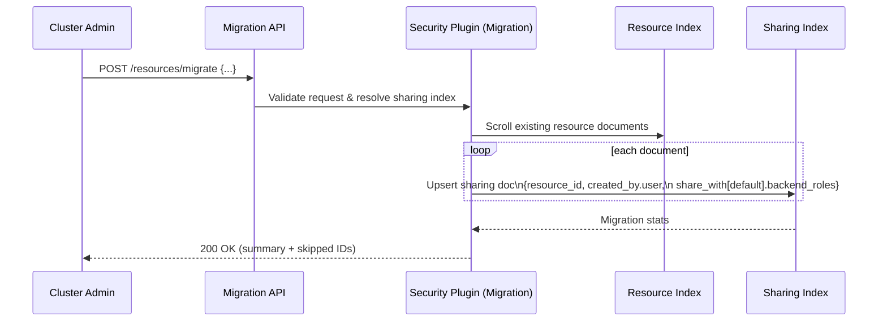

In [Part 1]({{site.baseurl}}/blog/introducing-resource-sharing), we introduced **resource sharing and access control** as a new way to collaborate on plugin-defined resources such as anomaly detectors and machine learning (ML) models.

This post explores the engineering decisions behind that feature:

* Why the legacy `filter_by_backend_roles` model wasn’t enough
* How we designed a **resource-centric** authorization model
* How plugins integrate using the new **Security SPI**
* How access checks work at query time
* How to migrate safely from legacy behavior

If you’re building or operating plugins in OpenSearch, this is the post you probably care about.

---

## From backend roles to resource owners

Before resource sharing, most OpenSearch plugins used a simple pattern:

* Each resource (detector, model, report, and so on) stored **identity metadata** (creator, backend roles).
* Visibility was controlled by checking for **backend role overlap** between creator and viewer.
* In Anomaly Detection, this was controlled by `plugins.anomaly_detection.filter_by_backend_roles`. In ML Commons, by `plugins.ml_commons.model_access_control_enabled`.

This approach worked for basic multi-tenancy but had significant limitations.

### Shortcomings of `filter_by_backend_roles`

1. **Implicit, role-coupled sharing**

   If two users shared a backend role, they could see each other’s resources. This meant:

   * No way for the owner to say “share with Alice, but not with Bob” if both users shared a role.
   * Removing access required changes to role mappings, not the resource itself.

2. **Overly broad cluster privileges**

   Because access was controlled at the **role** level, not the **resource** level:

   * Roles needed powerful cluster permissions just so users could operate on their own resources.
   * It was difficult to grant “read-only access to this one thing” without broader privileges.

3. **Distributed, plugin-specific metadata**

   Each plugin implemented its own access logic:

   * Different JSON structures for “owner” and “shared with”
   * Different user experience (UX) patterns in Dashboards
   * No central place to audit “who can see what”

The new framework addresses all these issues.

---

## Design goals

Our goals in designing resource sharing focused on four principles:

1. **Resource-centric security**  
   Authorization should be based on who owns a resource and who it is shared with—not accidental backend role overlaps.

2. **Centralized, reusable logic**  
   * One shared framework inside the Security plugin  
   * Plugins declare what is shareable and which actions exist  
   * Security handles how access is evaluated

3. **Minimal changes to plugin APIs**  
   Plugins should:
   * Continue exposing their existing REST APIs (such as `/detectors`, `/models`, `/reports`)
   * Delegate authorization to the Security framework
   * Avoid duplicating “get current user” boilerplate

4. **Safe migration**  
   We needed:
   * A way to import legacy sharing data into the new framework
   * Feature flags and per-type rollout
   * A reversible, observable migration process

---

## High-level architecture

At a high level, resource sharing divides responsibilities into three areas:

* **Resource plugins**: own functional resources (detectors, models, reports, dashboards)
* **Security plugin**: manages the sharing model and access evaluation
* **System indices**: store both resource data and corresponding sharing metadata

```mermaid
flowchart TD
    U[User / OpenSearch Dashboards] -->|Create/Read/Update/Delete| PL[Resource Plugin]

    subgraph Security[Security Plugin]
        API[Security REST Endpoints - Dashboards Share & List-Accessible]
        RAE[ResourceAccessEvaluator - automatic evaluation]
        MAP[Index - SharingIndex Mapping]
    end

    subgraph Data[System Indices - Per Plugin]
        RIDX1[(Resource Index A)]
        RSIDX1[(Sharing Index A)]
        RIDX2[(Resource Index B)]
        RSIDX2[(Sharing Index B)]
    end

    PL --> RIDX1
    PL --> RIDX2

%% Auto-eval for resource requests
    PL --> RAE
    RAE --> MAP
    MAP -->|resolve| RSIDX1
    MAP -->|resolve| RSIDX2

%% Dashboards Access Mgmt flows
    U -->|Share UI GET/PUT/PATCH| API
    API --> MAP
    MAP --> RSIDX1 & RSIDX2

````

---

## The resource-sharing data model

The framework introduces a dedicated sharing document per resource, stored in a Security-managed index.

### Sharing document structure

```json
{
  "resource_id": "model-group-123",
  "created_by": {
    "user": "bob",
    "tenant": "analytics-tenant"
  },
  "share_with": {
    "sample_read_only": {
      "users": ["user1", "user2"],
      "roles": ["viewer_role"],
      "backend_roles": ["data_analyst"]
    },
    "sample_read_write": {
      "users": ["admin_user"],
      "roles": ["editor_role"]
    }
  }
}
```

### Access levels as action groups

```yaml
resource_types:
  sample-resource:
    sample_read_only:
      allowed_actions:
        - "cluster:admin/sample-resource-plugin/get"
    sample_read_write:
      allowed_actions:
        - "cluster:admin/sample-resource-plugin/*"
    sample_full_access:
      allowed_actions:
        - "cluster:admin/sample-resource-plugin/*"
        - "cluster:admin/security/resource/share"
```

---

## Query-time evaluation

1. **Implicit filtering using `all_shared_principals`**

```json
{
  "name": "sharedDashboard",
  "all_shared_principals": [
    "user:alice",
    "role:analytics_team"
  ]
}
```

2. **Explicit checks using `ResourceSharingClient`**

```java
verifyAccess(resourceId, resourceIndex, action, listener);
getAccessibleResourceIds(resourceIndex, listener);
isFeatureEnabledForType(resourceType);
```

---

## Developer integration

1. **Add SPI dependency** in `build.gradle`
2. **Implement `ResourceSharingExtension`**
3. **Define action groups in `resource-action-groups.yml`**
4. **Use plugin client and system indices**

---

## Cluster controls

```yaml
plugins.security.experimental.resource_sharing.enabled: true
plugins.security.experimental.resource_sharing.protected_types: ["anomaly-detector", "ml-model"]
```

```curl
PUT _cluster/settings
{
  "persistent": {
    "plugins.security.experimental.resource_sharing.enabled": true,
    "plugins.security.experimental.resource_sharing.protected_types": [
      "anomaly-detector",
      "ml-model"
    ]
  }
}
```

---

## Migration from legacy behavior

```http
POST /_plugins/_security/api/resources/migrate
```

Example:

```json
{
  "source_index": ".sample_resource",
  "username_path": "/owner",
  "backend_roles_path": "/backend_roles",
  "default_owner": "some_user",
  "default_access_level": {
    "sample-resource": "read_only"
  }
}
```



---

## Dashboards integration

Dashboards uses:

* `PUT /_plugins/_security/api/resource/share`
* `POST /_plugins/_security/api/resource/share`
* `GET /_plugins/_security/api/resource/list`
* `GET /_plugins/_security/api/resource/types`

To enable a consistent UX for resource sharing.

---

## Putting it all together

This framework moves OpenSearch from:

* **Role-centric visibility** → based on backend role overlap
  to:
* **Resource-centric control** → based on ownership and explicit sharing

If you’re building a plugin and want to adopt resource sharing:

1. Implement `ResourceSharingExtension`
2. Define your resource action groups
3. Enable the feature for your resource type in a test cluster

You’ll inherit a full, centralized sharing model—automatically.
