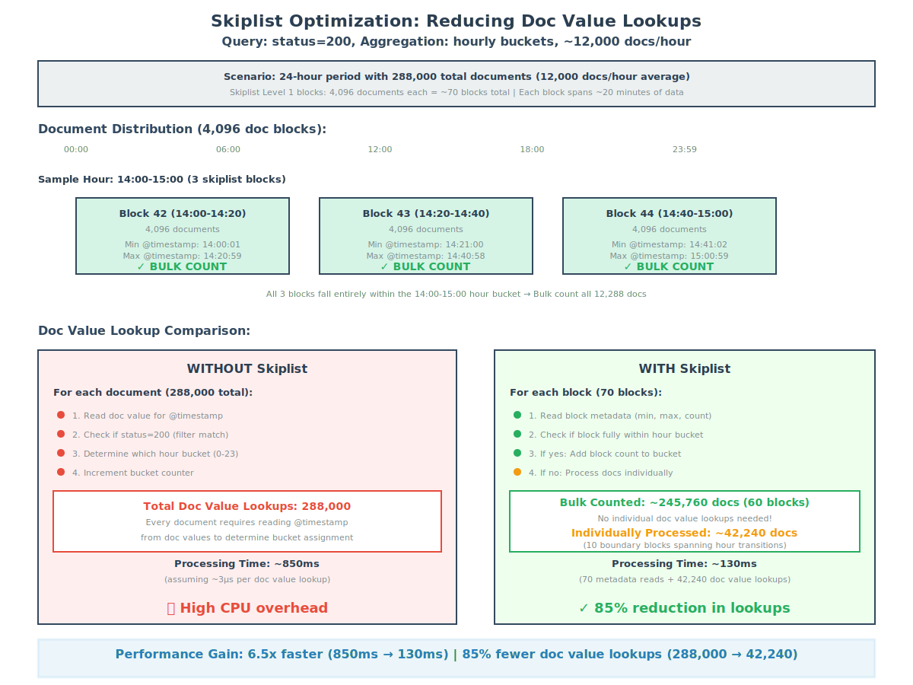

In our [previous blog post](https://opensearch.org/blog/transforming-bucket-aggregations-our-journey-to-100x-performance-improvement/), we described how filter rewrite and multi-range traversal delivered up to 100x faster date histogram aggregations by using Lucene's BKD tree. Those techniques worked remarkably well but had a fundamental limitation: they required the query filter and aggregation field to be the same, and they could not support complex subaggregation logic. When the filter field and aggregation field were different, or when subaggregations required per-document evaluation, the query engine still fell back to scanning every matching document one by one.

In this blog post, we describe how we overcame those limitations using Lucene 10's doc value skip indexes to deliver up to 28x faster aggregations even when filter and aggregation fields are uncorrelated.

## Where filter rewrite falls short

Filter rewrite transforms a date histogram aggregation into a series of range filters and then uses Lucene's BKD tree (the `Points` index) to count the number of documents per bucket without visiting individual doc values. Multi-range traversal further improved this by processing all buckets in a single sorted pass through the tree.

Both techniques rely on a key assumption: the field used in the query filter is the field being aggregated. Consider the following query, which filters on `trip_distance` but aggregates on `dropoff_datetime`:

```json
{
  "size": 0,
  "query": {
    "range": {
      "trip_distance": {
        "gte": 0,
        "lte": 20
      }
    }
  },
  "aggs": {
    "dropoffs_over_time": {
      "date_histogram": {
        "field": "dropoff_datetime",
        "calendar_interval": "month"
      }
    }
  }
}
```

Because `trip_distance` and `dropoff_datetime` are different fields, the BKD tree for `trip_distance` provides no information about how `dropoff_datetime` values are distributed across buckets. The engine cannot rewrite the aggregation into range filters on the aggregation field. It must fall back to the traditional approach: iterate over every matching document, retrieve its `dropoff_datetime` doc value, and place it into the correct bucket.

Similarly, when subaggregations require per-document computation (for example, calculating an average metric within each time bucket), a filter rewrite cannot help because it only provides document counts, not access to individual field values.

These are not edge cases. In practice, many analytical queries filter on one dimension while aggregating on another, and subaggregations are common in dashboards and reporting. We needed a more general approach.

## Doc value skip indexes: A new tool in the aggregation engine

Starting with Lucene 10.0, a new indexing structure became available: an optional skip index on top of numeric doc values, introduced in [PR #13449](https://github.com/apache/lucene/pull/13449) and refined with multi-level support in [PR #13563](https://github.com/apache/lucene/pull/13563). This structure is exposed through the `DocValuesSkipper` abstraction and provides the foundation for the optimizations described in this post.

### What is a skip index?

In general computer science, a skip list is a probabilistic data structure that layers multiple levels of linked lists on top of sorted data, using randomization to decide which elements appear at higher levels. This provides expected O(log n) search time.

Lucene's doc value skip index borrows the multi-level concept but is entirely deterministic. Rather than using randomization, it divides documents into fixed-size intervals and builds a hierarchy of summary levels at compile time during segment creation. There is no randomness involved: the structure is fully determined by the document count and the configured interval size.

Think of it like a table of contents for a book. Instead of scanning every page to find what you need, you check the chapter headings first, then the section headings, then narrow down to the exact page. The skip index works the same way: it lets the aggregation engine check summary metadata for large blocks of documents before deciding whether to examine individual values.

### How Lucene implements the skip index

Lucene's implementation uses a hierarchical structure with up to 4 levels (levels 0--3). The base level (level 0) summarizes documents in intervals of 4,096. Each subsequent level aggregates 8 intervals from the level below (a shift of 2^3), as shown in the following table.

| Level | Documents per interval | Description |
|-------|----------------------|-------------|
| 0 | 4,096 | Base interval |
| 1 | 32,768 (4,096 × 8) | Every 8 level-0 intervals |
| 2 | 262,144 (4,096 × 64) | Every 8 level-1 intervals |
| 3 | 2,097,152 (4,096 × 512) | Every 8 level-2 intervals |

For a worst-case index with 2^31 − 1 (~2.1 billion) documents, the skip index hierarchy contains approximately 524,288 entries at level 0, 65,536 at level 1, 8,192 at level 2, and 1,024 at level 3. Thus, the search space is reduced from billions of documents to a few thousand metadata checks.

Each interval entry is compact (just 29 bytes), encoding the following metadata:

1. **Number of levels** (1 byte): How many levels this entry is included in.
2. **Minimum and maximum value** (16 bytes): The range of field values within this interval.
3. **Minimum and maximum doc ID** (8 bytes): The document ID boundaries of this interval.
4. **Document count** (4 bytes): The number of documents in this interval.

This metadata enables the aggregation engine to make three decisions for each interval:

1. If the interval's min/max values fall **entirely outside** the current aggregation bucket, skip the entire interval.
2. If the interval's min/max values fall **entirely within** a single bucket, bulk-count all documents without individual inspection.
3. If the interval **spans multiple buckets**, fall back to processing documents individually.

The traversal starts at the highest available level and descends only when needed, similar to the way the BKD tree traversal in our previous optimizations skipped entire subtrees, as shown in the following figure. The key difference is that this structure operates on doc values rather than the `Points` index, so it works regardless of which field the query filters on.


*Figure 1: Skip index visualization showing how ranges of documents can be skipped or bulk-counted based on min/max metadata at each level.*

## How skip indexes address the limitations of filter rewrite

Recall the two main limitations we identified:

1. **Uncorrelated fields**: Filter rewrite requires the filter field and aggregation field to be the same.
2. **Complex subaggregations**: Filter rewrite only provides counts; it cannot support per-document computation within buckets.

Skip indexes address both limitations because they operate directly on the aggregation field's doc values, independent of how the matching document set was produced. The query engine first evaluates the query (using the indexes appropriate for the filter fields) to produce a set of matching document IDs. Then, during aggregation, it consults the skip index on the aggregation field to determine whether blocks of those matching documents can be skipped or bulk-counted.

This decoupling is the key insight. The skip index ignores whether the document set has been filtered. It only needs information about the aggregation field's value distribution within each interval.

### Example

For example, consider a query that filters on `process.name` (a term filter) and aggregates on `@timestamp` (a date histogram with daily buckets):

```json
GET /logs-*/_search
{
  "query": {
    "bool": {
      "must": [
        {
          "range": {
            "@timestamp": {
              "gte": "2024-01-01",
              "lte": "2024-01-31"
            }
          }
        },
        {
          "term": {
            "process.name": "systemd"
          }
        }
      ]
    }
  },
  "aggs": {
    "daily_counts": {
      "date_histogram": {
        "field": "@timestamp",
        "calendar_interval": "day"
      }
    }
  }
}
```

Without skip indexes, the range query on `@timestamp` could potentially benefit from filter rewrite, but the presence of the `term` filter on `process.name` prevents the query from being rewritten. The engine must iterate over every document matching both conditions and retrieve each `@timestamp` value individually.

With skip indexes enabled on `@timestamp`, the aggregation engine can consult the skip index during collection. When it encounters an interval in which the min and max `@timestamp` values both fall within the same daily bucket, it bulk-counts all matching documents in that interval without looking up individual values, as shown in the following diagram.


*Figure 2: With skip indexes enabled, when the engine lands on an interval whose min/max values fall within the same bucket (for example, Block 42 with values from 14:00:01 to 14:20:59), it bulk-counts the entire block. This process repeats across consecutive blocks until reaching a block that spans a bucket boundary (for example, crossing into the next day), at which point it falls back to individual doc value collection. This can reduce the total number of lookups by approximately 85%.*

## Efficient counting with popcount

There is a subtlety in the bulk-counting step that is worth examining. When the skip index indicates that all values in an interval fall within a single bucket, we know that bulk counting is possible; however, we cannot simply use the interval's document count directly. The skip index covers all documents in the segment, but the `DocIdSetIterator` produced by the query represents only the subset of documents that matched the query filters. We need to count how many documents from that filtered subset fall within the skip index interval.

One approach is to advance through the iterator one document at a time, counting as we go. But this defeats much of the purpose of skipping. Instead, we use a hardware-level optimization: the `popcount` (population count) CPU instruction, which counts the number of set bits in a machine word in a single operation.

When the query engine produces a `DocIdSetIterator`, it often represents the matching document set internally as a bitset, in which each bit corresponds to a document ID and is set to `1` if the document matched the query. To count how many matching documents fall within a skip index interval, we extract the relevant portion of this bitset (the bits corresponding to doc IDs within the interval's min/max doc ID range) and apply `popcount` across those words. This gives us the exact number of matching documents in the interval without iterating over them individually.

The `DocIdSetIterator` also supports a bulk collection interface: rather than calling `nextDoc()` repeatedly, the collector can receive a stream of doc IDs. When all doc IDs in a stream fall within the same bucket (as determined by the skip index), the entire stream can be collected in one operation. This combination of skip index metadata for bucket determination and `popcount` for efficient counting within the filtered set is what makes the optimization practical. Preliminary benchmarks show up to an additional 3x improvement from this approach on top of the skip index gains described earlier.

## Sorted data: Where skip indexes shine

Skip indexes deliver their best performance when documents are sorted by the aggregation field. When data is sorted, consecutive documents have similar or monotonically increasing values, which means the min/max range within each 4,096-document interval is narrow. Narrow ranges are more likely to fall entirely within a single aggregation bucket, maximizing the opportunities for bulk-counting.

For time-series workloads (log analytics, metrics, and observability), the timestamp field is a natural fit. Most time-series data arrives in roughly chronological order, and data streams in OpenSearch maintain this ordering (see [Data streams](https://docs.opensearch.org/latest/im-plugin/data-streams/)).

### Ensuring data remains sorted

Simply having a timestamp field does not guarantee the data stays sorted as segments merge and documents are added. There are two approaches to maintain sort order.

1. **Index sort (recommended)**: Configure an explicit index sort setting to ensure data remains sorted regardless of segment merges:

    ```json
    {
      "settings": {
        "index.sort.field": "@timestamp",
        "index.sort.order": "desc"
      }
    }
    ```

    This guarantees that all segments maintain timestamp order, providing consistent skip index performance.

2. **Log merge policy**: Alternatively, use a merge policy that preserves the incoming document order. The `log_byte_size` merge policy tends to maintain temporal ordering for append-only workloads typical of time-series data.

    When data is unsorted, the skip index still functions correctly but provides fewer opportunities for skipping and bulk-counting, because each interval's min/max range is likely to span multiple buckets.

## Enabling skip indexes

Skip indexes can be enabled automatically or through manual configuration, depending on your OpenSearch version.

### Default behavior by version

OpenSearch has progressively expanded skip index support, as shown in the following table.

| Version | Behavior |
|---------|----------|
| OpenSearch 3.2 | Introduces the `skip_list` mapping parameter for numeric fields (default: `false`) |
| OpenSearch 3.3 | Automatically enables skip index for date fields named `@timestamp` on date histogram aggregations |
| OpenSearch 3.4 | Extends automatic skip index optimization to auto date histogram aggregations on `@timestamp` |

For more information, see the [Date field type](https://docs.opensearch.org/latest/mappings/supported-field-types/date/).

### Manual configuration

To enable skip indexes on other numeric fields, add the `skip_list` parameter to your field mapping:

```json
PUT /my-index
{
  "mappings": {
    "properties": {
      "custom_timestamp": {
        "type": "date",
        "skip_list": true
      },
      "price": {
        "type": "long",
        "skip_list": true
      }
    }
  }
}
```

## Performance results

We measured performance using OpenSearch Benchmark with the `http_logs` and `big5` datasets. The results demonstrate significant improvements, particularly for queries where filter rewrite could not previously help.

### Date histogram performance (http_logs workload)

The following table compares baseline performance with skip index performance, based on testing from [PR #19130](https://github.com/opensearch-project/OpenSearch/pull/19130) using the `http_logs` dataset.

| Operation | Baseline (p90) | With skip index (p90) | Improvement |
|-----------|----------------|----------------------|-------------|
| `hourly_agg_with_filter` | 998 ms | 36 ms | **28x faster** |
| `hourly_agg_with_filter_and_metrics` | 1,618 ms | 970 ms | **40% faster** |

The first operation shows the full benefit of skip indexes on a pure counting aggregation with an uncorrelated filter. The second operation includes subaggregations (metrics), in which the improvement is smaller because per-document metric computation still requires individual value lookups for the metric fields.

Throughput improved by 21% for date histogram queries with no measurable impact on indexing performance.

### Auto date histogram performance (big5 workload)

OpenSearch 3.4 extended skip index optimization to auto date histogram aggregations. The following table compares baseline performance with skip index performance, based on testing from [PR #20057](https://github.com/opensearch-project/OpenSearch/pull/20057) using the `big5` dataset.

| Operation | Baseline (p90) | With skip index (p90) | Improvement |
|-----------|----------------|----------------------|-------------|
| `range-auto-date-histo` | 2,099 ms | 324 ms | **6.5x faster** |
| `range-auto-date-histo-with-metrics` | 5,733 ms | 3,928 ms | **35% faster** |

These results combine the filter rewrite optimization for the range query with skip indexes for the auto date histogram, demonstrating how the two techniques complement each other.

### Index size impact

Skip indexes introduce minimal storage overhead, as shown in the following table.

| Configuration | Size increase |
|--------------|---------------|
| `@timestamp` field only | ~0.1% |
| All numeric fields | ~1% (for example, 22 GB → 23 GB on big5) |

Because of this minimal overhead, OpenSearch enables skip indexes by default only on `@timestamp` fields, providing targeted benefits without significant storage costs.

## How skip indexes complement previous optimizations

Skip indexes do not replace filter rewrite and multi-range traversal; they complement them. The following table summarizes when each technique applies.

| Technique | When it applies | Limitation |
|-----------|----------------|------------|
| Filter rewrite | Filter field = aggregation field, simple counting | Cannot handle uncorrelated fields or subaggregations |
| Multi-range traversal | Same as filter rewrite, with many buckets | Same limitations as filter rewrite |
| Skip index | Any query pattern, any aggregation field | Best on sorted data; falls back gracefully on unsorted data |

When a query is eligible for filter rewrite, OpenSearch uses filter rewrite because it avoids doc value access entirely. When filter rewrite cannot apply, skip indexes provide a fallback that is still significantly faster than scanning every document. The two approaches cover complementary parts of the query space.

## Looking ahead

The OpenSearch community is actively extending skip index capabilities and exploring complementary optimizations:

- **Min/max aggregations**: Using skip index metadata for instant min/max calculations without visiting any documents ([issue #20174](https://github.com/opensearch-project/OpenSearch/issues/20174)).
- **Enhanced bucket handling**: Supporting multiple owning bucket ordinals for more complex aggregation patterns.
- **Bulk processing and vectorization**: Recent work in Lucene has focused on restructuring collection loops to process documents in batches rather than one at a time. By loading field values into contiguous buffers and operating on them in bulk, the JVM can apply auto-vectorization and SIMD instructions to compute scalar functions (sums, averages, and min/max) across many values simultaneously. This batch-oriented approach also reduces virtual method call overhead: instead of invoking a virtual `collect()` method per document, the engine can invoke it once per batch, allowing the JVM's JIT compiler to inline the hot path more effectively. These techniques are especially promising for subaggregations that compute metrics within each bucket, where per-document overhead currently dominates.

This work continues the iterative approach we described in our previous post: identify the bottleneck, understand the underlying data structures, and find ways to avoid unnecessary work. Filter rewrite taught us that counting documents through an index tree is faster than iterating over doc values. Skip indexes extend that lesson: even when we must use doc values, we can still avoid looking at every single one.

To learn more or contribute, see the [meta issue #18882](https://github.com/opensearch-project/OpenSearch/issues/18882) for the complete skip index implementation plan and [issue #19384](https://github.com/opensearch-project/OpenSearch/issues/19384) for benchmark results and ongoing work.
